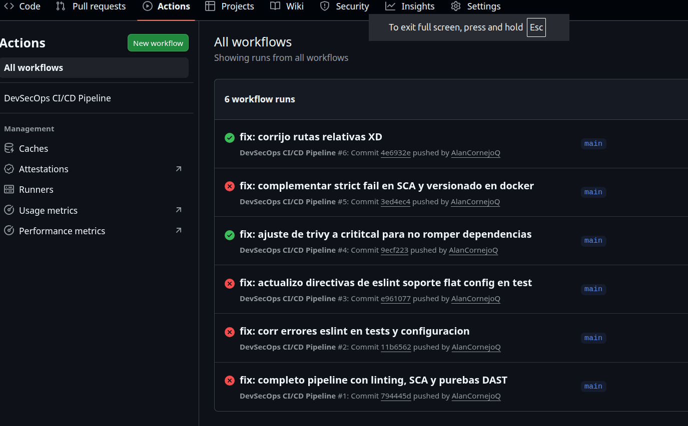
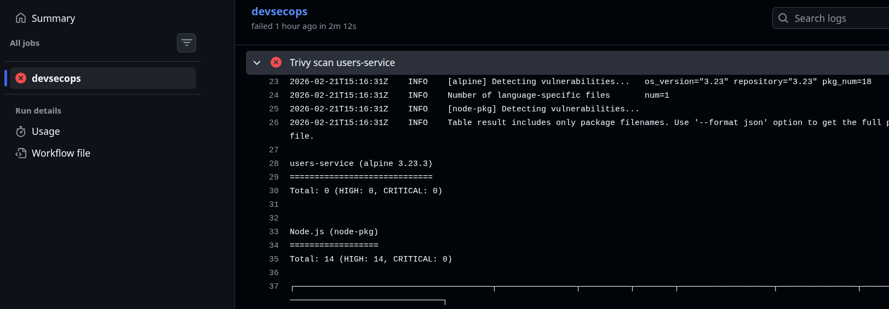
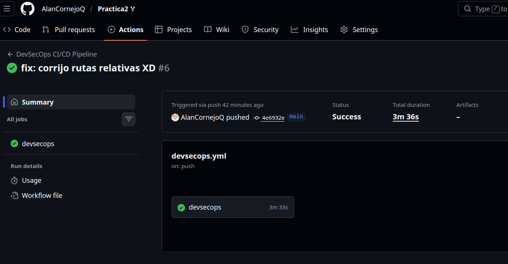

# Práctica 2: Integración DevSecOps CI/CD
### Nombre: Elmer Alan Cornejo Quito
### Respositorio: [https://github.com/AlanCornejoQ/Practica2]
## 1. Justificación Técnica de Decisiones (Pipeline DevSecOps)

En el presente repositoro se ha diseñado e implementado un pipeline CI/CD automatizado mediante gitHub Actions. El objetivo es garantizar que el código solo avance hacia la fase de despliegue si cumple con estrictos criterios funcionales y de seguridad, aplicando un enfoque DevSecOps.

A continuación, la justificación técnica de cada etapa implementada:

* **A. Instalación Reproducible (`npm ci`)**
  * **Fase:** Build (Construcción).
  * **Riesgo mitigado:** Inconsistencias entre entornos de desarrollo y producción.
  * **Necesidad:** Aunque la app funcione localmente, `npm ci` es vital para bloquear versiones de dependencias no probadas que podrían romper despliegues futuros .

* **B. Análisis de Calidad (`ESLint`)**
  * **Fase:** Code (Calidad continua).
  * **Riesgo mitigado:** Deuda técnica, variables sin uso y malas prácticas.
  * **Necesidad:** Un código funcional no siempre es mantenible; el linter estandariza el código para evitar errores lógicos a largo plazo.

* **C. Pruebas Unitarias (`Jest` / `npm test`)**
  * **Fase:** Test.
  * **Riesgo mitigado:** Regresiones de software.
  * **Necesidad:** Actúa como red de seguridad para garantizar que los nuevos parches no rompan la funcionalidad actual.

* **D. Seguridad de Dependencias - SCA (`npm audit`)**
  * **Fase:** Secure (SCA).
  * **Riesgo mitigado:** Inclusión de librerías de terceros con vulnerabilidades críticas (CVEs).
  * **Necesidad:** Nuestro código base puede ser seguro, pero una sola dependencia externa comprometida expone todo el sistema.

* **E. Seguridad Estática - SAST (`Semgrep`)**
  * **Fase:** Secure (SAST).
  * **Riesgo mitigado:** Vulnerabilidades en código propio (inyecciones, secretos hardcodeados).
  * **Necesidad:** Analiza la lógica de negocio en busca de patrones inseguros antes de generar el contenedor.

* **F. Seguridad de Contenedores (`Trivy`)**
  * **Fase:** Package / Release.
  * **Riesgo mitigado:** Fallos de seguridad en el SO base de la imagen Docker.
  * **Necesidad:** Garantiza que la infraestructura inmutable (como Alpine o Node base) no arrastre vulnerabilidades al entorno de producción.

* **G. Smoke Test y DAST (`curl`)**
  * **Fase:** Deploy / Test Dinámico.
  * **Riesgo mitigado:** Endpoints desprotegidos y fallos de conexión de red.
  * **Necesidad:** Comprueba en tiempo de ejecución que los microservicios se comunican y que el API Gateway bloquea efectivamente accesos no autorizados sin un JWT válido.

## 2. Evidencias de Ejecución 

A continuación, se adjuntan las evidencias de que el pipeline funciona correctamente, bloqueando el código cuando detecta riesgos y permitiendo el paso cuando se cumplen los estándares:

### Historial de Ejecuciones
En esta captura se observa el proceso iterativo, evidenciando cómo los *gates* detuvieron el flujo inicialmente y cómo, tras las correcciones, el pipeline finalizó con éxito.

### Evidencia de Gate Fallido (Bloqueo de seguridad)
El pipeline bloqueó exitosamente el despliegue debido a configuraciones estrictas, demostrando la mitigación automatizada de deuda técnica/vulnerabilidades.

*(Enlace a la ejecución fallida: [https://github.com/AlanCornejoQ/Practica2/actions/runs/22259153668])*

### Ejecución Exitosa (Pipeline DevSecOps aprobado)
Flujo completo tras resolver los hallazgos de seguridad y formato. Todas las etapas de DevSecOps finalizaron correctamente.

*(Enlace a la ejecución exitosa: [https://github.com/AlanCornejoQ/Practica2/actions/runs/22259689372])*

---

---
    

---

 

## Enfoque de la práctica
Esta práctica debe ser implementada, no solo diseñada.
El objetivo es aplicar DevSecOps de manera práctica, integrando:
        - - Front-end
        - - Back-end
        - - Inicio de sesión seguro
        - - Arquitectura de microservicios
        - - Automatización CI/CD con seguridad embebida
     

# 1. Adición del Front-end

[ Front-end ]
     |
     | Login / JWT
     v
[ users-service ]
     |
     | JWT
     v
[ api-gateway ]
     |
     v
[ academic-service ]

## Integración DevSecOps (obligatoria)
El Front-end y el inicio de sesión deben estar cubiertos por el pipeline DevSecOps existente:

- SAST: análisis del código de autenticación y manejo de inputs.
- SCA: análisis de dependencias relacionadas con seguridad.
- DAST: pruebas de acceso no autorizado a endpoints protegidos.

**El login no se asume seguro, se valida automáticamente

## Propósito de esta extensión
Consolidar una visión end-to-end DevSecOps, donde:
 - El diseño,
 - La seguridad,
 - La automatización,
  Y la experiencia de usuario,
se integran desde las primeras etapas del desarrollo.

## Pipeline 
Commit / Pull Request
   ↓
Tests automatizados
   ↓
SAST (Semgrep)
   ↓
Build (Docker)
   ↓
SCA (dependencias)
   ↓
Deploy automático
   ↓
DAST (aplicación en ejecución)

## Docker Compose
docker-compose down
docker-compose up --build

## Estructura del Pipeline
Push / Pull Request
   ↓
Install dependencies
   ↓
Tests (backend + frontend)
   ↓
SAST (Semgrep)
   ↓
Build Docker images
   ↓
SCA (Trivy)
   ↓
docker-compose up
   ↓
Smoke tests

## Kubernetes
kubectl apply -f k8s/users-service/
kubectl apply -f k8s/academic-service/
kubectl apply -f k8s/api-gateway/

kubectl get pods
kubectl get services

# Correr api-gateway
minikube service api-gateway
minikube start
# Trabajar con Docker
eval $(minikube docker-env -u)
# Trabajar Docker dentro Kubernetes
1. minikube start --driver=docker
   eval $(minikube docker-env)
2. minikube status
3. kubectl config current-context
4. kubectl get nodes
## Construir las imágenes
docker build -t frontend:latest ../frontend
kubectl get pods -n backend
docker build -t users-service:latest ../backend/users-service

## Desplegar en Kubernetes
kubectl apply -f k8s/namespace.yaml
kubectl apply -f k8s/users-service/
kubectl apply -f k8s/academic-service/
kubectl apply -f k8s/api-gateway/
kubectl apply -f k8s/frontend/

# eliminar cluster
minikube delete

minikube start
eval $(minikube docker-env)

docker build -t users-service backend/users-service
docker build -t academic-service backend/academic-service
docker build -t api-gateway backend/api-gateway
docker build -t frontend frontend

kubectl apply -f k8s/